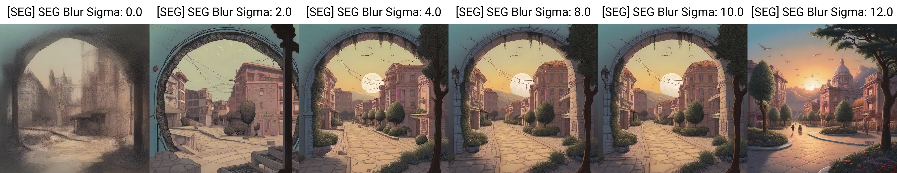
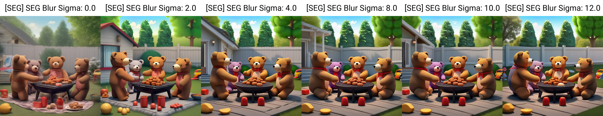
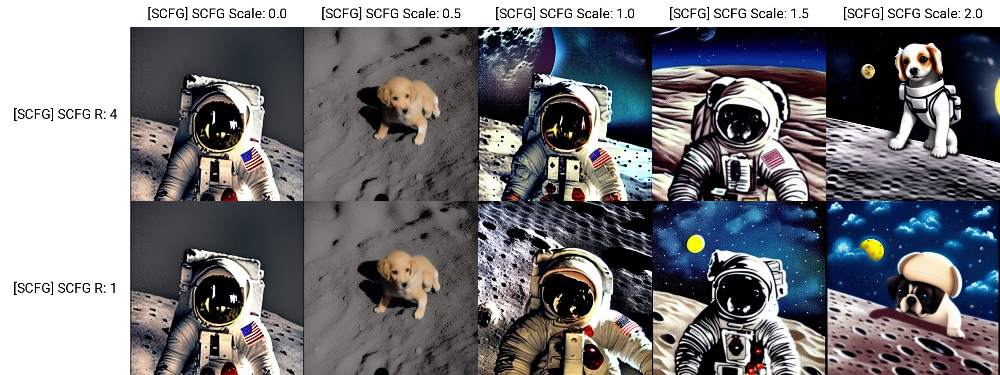

# sd-webui-incantations

# Table of Contents
- [What is this?](#what-is-this)
- [Installation](#installation)
- [Compatibility Notice](#compatibility-notice)
- [News](#compatibility-notice)
- [Extension Features](#extension-features)
    - [Smoothed Energy Guidance](#smoothed-energy-guidance)
    - [Semantic CFG](#semantic-cfg-s-cfg)
    - [Perturbed Attention Guidance](#perturbed-attention-guidance)
    - [CFG Scheduler](#cfg-interval--cfg-scheduler)
    - [Multi-Concept T2I-Zero](#multi-concept-t2i-zero--attention-regulation)
    - [Seek for Incantations](#seek-for-incantations)
- [Tutorial](#tutorial)
- [Other cool extensions](#also-check-out)
- [Credits](#credits)

## What is this?
### This extension for [AUTOMATIC1111/stable-diffusion-webui](https://github.com/AUTOMATIC1111/stable-diffusion-webui) implements algorithms from state-of-the-art research to achieve **higher-quality** images with *more accurate* prompt adherence.

All methods are **training-free** and rely only on modifying the text embeddings or attention maps.


## Installation
To install the `sd-webui-incantations` extension, follow these steps:

0. **Ensure you have the latest Automatic1111 stable-diffusion-webui version ≥ 1.93 installed**

1. **Open the "Extensions" tab and navigate to the "Install from URL" section**:

2. **Paste the repository URL into the "URL for extension's git repository" field**:  
    ```
    https://github.com/v0xie/sd-webui-incantations.git
    ```
    
3. **Press the Install button**: Wait a few seconds for the extension to finish installing.
    
4. **Restart the Web UI**:
    Completely restart your Stable Diffusion Web UI to load the new extension.

## Compatibility Notice
* Incompatible with **stable-diffusion-webui-forge**: Use this extension with Forge: https://github.com/pamparamm/sd-perturbed-attention
* Reported incompatible with Adetailer: https://github.com/v0xie/sd-webui-incantations/issues/21
* Reported incompatible with ControlNet Reference Only: https://github.com/v0xie/sd-webui-incantations/pull/47
* Incompatible with some older webui versions: https://github.com/v0xie/sd-webui-incantations/issues/14
* May conflict with other extensions which modify the CFGDenoiser

## News
- 2024-07-02 🔥 - Smoothed Energy Guidance! https://github.com/v0xie/sd-webui-incantations/pull/60
- 2024-06-07 🔥 - Saliency Adaptive Noise Fusion for PAG, and bug-fixes! https://github.com/v0xie/sd-webui-incantations/pull/52
- 2024-05-15 🔥 - S-CFG, optimizations for PAG and T2I-Zero, and more! https://github.com/v0xie/sd-webui-incantations/pull/37
- 2024-04-29 🔥 - The implementation of T2I-Zero is fixed and works much more stably now.

# Extension Features

---
## Smoothed Energy Guidance
Increases quality of outputs by blurring the self-attention in the middle block layers, with minimal added inference time.
Recommended to fix the CFG scale to 3.0, and control the effect using the Blur Sigma value. Increase CFG if the effect is insufficient.

#### Controls
* **SEG Blur Sigma** - Controls the sigma value (2^sigma) in the Gaussian Blur. Values greater than 10.5 is "infinite blur".
* **Start Step**: Start SEG on this step.
* **End Step**: End SEG after this step.

#### Results
SD XL

* Unconditional


- Prompt: "a family of teddy bears having a barbecue in their backyard"


#### Also check out the paper authors' official project repository:
- https://github.com/SusungHong/SEG-SDXL

#### [Return to top](#sd-webui-incantations)

---
## Semantic CFG (S-CFG)
https://arxiv.org/abs/2404.05384  
Dynamically rescale CFG guidance per semantic region to a uniform level to improve image / text alignment.  
**Very computationally expensive**: A batch size of 4 with 1024x1024 will max out a 24GB 4090.

#### Controls
* **SCFG Scale**: Multiplies the correction by a constant factor. Default: 1.0.
* **SCFG R**: A hyperparameter controlling the factor of cross-attention map refinement. Higher values use more memory and computation time. Default: 4.
* **Rate Min**: The minimum rate that the CFG can be scaled by. Default: 0.8.
* **Rate Max**: The maximum rate that the CFG can be scaled by. Default: 3.0.
* **Clamp Rate**: Overrides Rate Max. Clamps the Max Rate to Clamp Rate / CFG. Default: 0.0.
* **Start Step**: Start S-CFG on this step.
* **End Step**: End S-CFG after this step.

#### Results
Prompt: "A cute puppy on the moon", Min Rate: 0.5, Max Rate: 10.0
- SD 1.5  


#### Also check out the paper authors' official project repository:
- https://github.com/SmilesDZgk/S-CFG

#### [Return to top](#sd-webui-incantations)

---
## Perturbed Attention Guidance
https://arxiv.org/abs/2403.17377  
An alternative/complementary method to CFG (Classifier-Free Guidance) that increases sampling quality.

# Update: 20-05-2024
Implemented a new feature called "Saliency-Adaptive Noise Fusion" derived from ["High-fidelity Person-centric Subject-to-Image Synthesis"](https://arxiv.org/abs/2311.10329).  

This feature combines the guidance from PAG and CFG in an adaptive way that improves image quality especially at higher guidance scales.  

Check out the paper authors' project repository here: https://github.com/CodeGoat24/Face-diffuser  

#### Controls
* **Use Saliency-Adaptive Noise Fusion**: Use improved method of combining CFG + PAG.
* **PAG Scale**: Controls the intensity of effect of PAG on the generated image.  
* **PAG Start Step**: Step to start using PAG.
* **PAG End Step**: Step to stop using PAG. 

#### Results
Prompt: "a puppy and a kitten on the moon"
- SD 1.5  


- SD XL  


#### Also check out the paper authors' official project page:
- https://ku-cvlab.github.io/Perturbed-Attention-Guidance/

#### [Return to top](#sd-webui-incantations)

---

## CFG Interval / CFG Scheduler
https://arxiv.org/abs/2404.07724 and https://arxiv.org/abs/2404.13040 

Constrains the usage of CFG to within a specified noise interval. Allows usage of high CFG levels (>15) without drastic alteration of composition.  

Adds controllable CFG schedules. For Clamp-Linear, use (c=2.0) for SD1.5 and (c=4.0) for SDXL. For PCS, use (s=1.0) for SD1.5 and (s=0.1) for SDXL.  

To use CFG Scheduler, PAG Active must be set True! PAG scale can be set to 0.

#### Controls
* **Enable CFG Scheduler**: Enables the CFG Scheduler.
* **CFG Schedule Type**: Sets the schedule type to apply CFG.
    - Constant: The default CFG method (constant value over all timesteps)
    - Interval: Constant with CFG only being applied within the specified noise interval!
    - Clamp-Linear: Clamps the CFG to the maximum of (c, Linear)
    - Clamp-Cosine: Clamps the CFG to the maximum of (c, Cosine)
    - PCS: Powered Cosine, lower values are typically better
* **CFG Noise Interval Start**: Minimum noise level to use CFG with. SDXL recommended value: 0.28.
* **CFG Noise Interval End**: Maximum noise level to use CFG with. SDXL recommended value: >5.42.


#### Results
##### CFG Interval
Prompt: "A pointillist painting of a raccoon looking at the sea."
- SD XL  


##### CFG Schedule
Prompt: "An epic lithograph of a handsome salaryman carefully pouring coffee from a cup into an overflowing carafe, 4K, directed by Wong Kar Wai"
- SD XL  


#### [Return to top](#sd-webui-incantations)
---
## Multi-Concept T2I-Zero / Attention Regulation

#### Update: 29-04-2024
The algorithms previously implemented for T2I-Zero were incorrect. They should be working much more stably now. See the previous result in the 'images' folder for an informal comparison between old and new.

Implements Corrections by Similarities and Cross-Token Non-Maximum Suppression from https://arxiv.org/abs/2310.07419

Also implements some methods from "Enhancing Semantic Fidelity in Text-to-Image Synthesis: Attention Regulation in Diffusion Models" https://arxiv.org/abs/2403.06381

#### Corrections by Similarities
Reduces the contribution of tokens on far away or conceptually unrelated tokens.

#### Cross-Token Non-Maximum Suppression
Attempts to reduces the mixing of features of unrelated concepts.

#### Controls:
* **Step End**: After this step, the effect of both CbS and CTNMS ends.
* **Correction by Similarities Window Size**: The number of adjacent tokens on both sides that can influence each token
* **CbS Score Threshold**: Tokens with similarity below this threshold have their effect reduced
* **CbS Correction Strength**: How much the Correction by Similarities effects the image.
* **Alpha for Cross-Token Non-Maximum Suppression**: Controls how much effect the attention maps of CTNMS affects the image.
* **EMA Smoothing Factor**: Smooths the results based on the average of the results of the previous steps. 0 is disabled.

#### Known Issues:
Can error out with image dimensions which are not a multiple of 64

#### Results:
Prompt: "A photo of a lion and a grizzly bear and a tiger in the woods"  
SD XL  


#### Also check out the paper authors' official project pages:
- https://multi-concept-t2i-zero.github.io/ 
- https://github.com/YaNgZhAnG-V5/attention_regulation

#### [Return to top](#sd-webui-incantations)
---
### Seek for Incantations
An incomplete implementation of a "prompt-upsampling" method from https://arxiv.org/abs/2401.06345  
Generates an image following the prompt, then uses CLIP text/image similarity to add on to the prompt and generate a new image.  

#### Controls:
* **Append Generated Caption**: If true, will append an additional interrogated caption to the prompt. For Deepbooru Interrogate, recommend disabling.
* **Deepbooru Interrogate**: Uses Deepbooru to interrogate instead of CLIP.
* **Delimiter**: The word to separate the original prompt and the generated prompt. Recommend trying BREAK, AND, NOT, etc.
* **Word Replacement**: The word/token to replace dissimilar words with.
* **Gamma**: Replaces words below this level of similarity with the Word Replacement.

For example, if your prompt is "a blue dog", delimiter is "BREAK", and word replacement is "-", and the level of similarity of the word "blue" in the generated image is below gamma, then the new prompt will be "a blue dog BREAK a - dog"

A WIP implementation of the "prompt optimization" methods are available in branch ["s4a-dev2"](https://github.com/v0xie/sd-webui-incantations/tree/s4a-dev2)


#### Results:
SD XL  
* Original Prompt: cinematic 4K photo of a dog riding a bus and eating cake and wearing headphones  
* Modified Prompt: cinematic 4K photo of a dog riding a bus and eating cake and wearing headphones BREAK - - - - - dog - - bus - - - - - -


#### [Return to top](#sd-webui-incantations)
---

### Issues / Pull Requests are welcome!
---

### Tutorial

[**Improve Stable Diffusion Prompt Following & Image Quality Significantly With Incantations Extension**](https://youtu.be/lMQ7DIPmrfI)

[](https://youtu.be/lMQ7DIPmrfI)

#### [Return to top](#sd-webui-incantations)

## Also check out:

* **Characteristic Guidance**: Awesome enhancements for sampling at high CFG levels [https://github.com/scraed/CharacteristicGuidanceWebUI](https://github.com/scraed/CharacteristicGuidanceWebUI) 

* **A1111-SD-WebUI-DTG**: Awesome prompt upsampling method for booru trained anime models [https://github.com/KohakuBlueleaf/z-a1111-sd-webui-dtg](https://github.com/KohakuBlueleaf/z-a1111-sd-webui-dtg)

* **CADS**: Diversify your generated images [https://github.com/v0xie/sd-webui-cads](https://github.com/v0xie/sd-webui-cads)  

* **Semantic Guidance**:  [https://github.com/v0xie/sd-webui-semantic-guidance](https://github.com/v0xie/sd-webui-semantic-guidance)  

* **Agent Attention**: Faster image generation and improved image quality with Agent Attention [https://github.com/v0xie/sd-webui-agentattention](https://github.com/v0xie/sd-webui-agentattention)

#### [Return to top](#sd-webui-incantations)
--- 

### Credits
- The authors of the papers for their methods:  

      @misc{yu2024seek,
       title={Seek for Incantations: Towards Accurate Text-to-Image Diffusion Synthesis through Prompt Engineering}, 
       author={Chang Yu and Junran Peng and Xiangyu Zhu and Zhaoxiang Zhang and Qi Tian and Zhen Lei},
       year={2024},
       eprint={2401.06345},
       archivePrefix={arXiv},
       primaryClass={cs.CV}
      }

      @misc{tunanyan2023multiconcept,
       title={Multi-Concept T2I-Zero: Tweaking Only The Text Embeddings and Nothing Else}, 
       author={Hazarapet Tunanyan and Dejia Xu and Shant Navasardyan and Zhangyang Wang and Humphrey Shi},
       year={2023},
       eprint={2310.07419},
       archivePrefix={arXiv},
       primaryClass={cs.CV}
      }

      @misc{ahn2024selfrectifying,
       title={Self-Rectifying Diffusion Sampling with Perturbed-Attention Guidance}, 
       author={Donghoon Ahn and Hyoungwon Cho and Jaewon Min and Wooseok Jang and Jungwoo Kim and SeonHwa Kim and Hyun Hee Park and Kyong Hwan Jin and Seungryong Kim},
       year={2024},
       eprint={2403.17377},
       archivePrefix={arXiv},
       primaryClass={cs.CV}
      }

      @misc{zhang2024enhancing,
       title={Enhancing Semantic Fidelity in Text-to-Image Synthesis: Attention Regulation in Diffusion Models},
       author={Yang Zhang and Teoh Tze Tzun and Lim Wei Hern and Tiviatis Sim and Kenji Kawaguchi},
       year={2024},
       eprint={2403.06381},
       archivePrefix={arXiv},
       primaryClass={cs.CV}
      }

      @misc{kynkäänniemi2024applying,
       title={Applying Guidance in a Limited Interval Improves Sample and Distribution Quality in Diffusion Models}, 
       author={Tuomas Kynkäänniemi and Miika Aittala and Tero Karras and Samuli Laine and Timo Aila and Jaakko Lehtinen},
       year={2024},
       eprint={2404.07724},
       archivePrefix={arXiv},
       primaryClass={cs.CV}
      }

      @misc{wang2024analysis,
       title={Analysis of Classifier-Free Guidance Weight Schedulers}, 
       author={Xi Wang and Nicolas Dufour and Nefeli Andreou and Marie-Paule Cani and Victoria Fernandez Abrevaya and David Picard and Vicky Kalogeiton},
       year={2024},
       eprint={2404.13040},
       archivePrefix={arXiv},
       primaryClass={cs.CV}
      }

      @misc{shen2024rethinking,
       title={Rethinking the Spatial Inconsistency in Classifier-Free Diffusion Guidance}, 
       author={Dazhong Shen and Guanglu Song and Zeyue Xue and Fu-Yun Wang and Yu Liu},
       year={2024},
       eprint={2404.05384},
       archivePrefix={arXiv},
       primaryClass={cs.CV}
      }
    
      @misc{wang2024highfidelity,
        title={High-fidelity Person-centric Subject-to-Image Synthesis}, 
        author={Yibin Wang and Weizhong Zhang and Jianwei Zheng and Cheng Jin},
        year={2024},
        eprint={2311.10329},
        archivePrefix={arXiv},
        primaryClass={cs.CV}
      }

      @misc{hong2024smoothedenergyguidanceguiding,
        title={Smoothed Energy Guidance: Guiding Diffusion Models with Reduced Energy Curvature of Attention}, 
        author={Susung Hong},
        year={2024},
        eprint={2408.00760},
        archivePrefix={arXiv},
        primaryClass={cs.CV},
        url={https://arxiv.org/abs/2408.00760}
      }
}


- [Hard Prompts Made Easy](https://github.com/YuxinWenRick/hard-prompts-made-easy)
- [@udon-universe's extension templates](https://github.com/udon-universe/stable-diffusion-webui-extension-templates)

#### [Return to top](#sd-webui-incantations)
---

